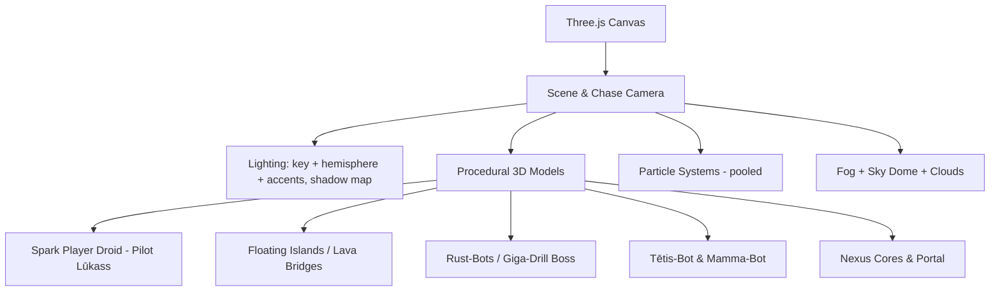

# Cyber-Shield: Spark's Rescue — Game Design & Implementation Plan (v2)

A high-fidelity **3D action-adventure web game** built with Three.js, designed for a 10-year-old player.
Two goals rule every decision in this plan:

1. **Real 3D feeling** — depth, scale, light, and a living camera. It must *feel* like a real console game, not shapes on a flat screen.
2. **Perfect to play** — instantly understandable, forgiving, exciting, and never frustrating.

---

## 1. The Game Story

### The Lore
Floating high above the clouds is the **Sky Sanctuary**, a peaceful home to floating helper droids. The sanctuary is powered by **Nexus Cores**, glowing crystals of pure energy.
One day, the sky turns dark. A malicious computer virus infects the factory below, creating the **Rust-Bots** — robotic invaders seeking to drain the sanctuary's energy. Their leader, a giant spider-like mining mech named the **Giga-Drill**, has dug straight into the planet's **Lava Core** to steal the main power generator.

### The Hero
The hero is **LŪKASS** — the bravest young pilot in the Sky Sanctuary! He flies **Spark**, his trusty little yellow hover-droid equipped with a glowing blue neon energy sword and a plasma forcefield. Together, Lūkass and Spark are the sanctuary's last line of defense!
- Lūkass's name appears **everywhere**: the title screen ("PILOT: LŪKASS"), the HUD, hint messages ("Nice jump, Lūkass!"), and the victory screen ("LŪKASS SAVED THE SANCTUARY!").
- The hero name is a single constant in the code (`PLAYER_NAME = "LŪKASS"`) so it shows consistently in every message.

### The Family Twist 👨‍👩‍👦
The evil virus didn't stop at building Rust-Bots — it **hacked and hypnotized the Sanctuary's two beloved family helper-bots**:
- **TĒTIS-BOT** — a big, strong, funny dad-robot 🥿
- **MAMMA-BOT** — a fast, clever mom-robot 🧹

Their friendly green eyes have turned virus-red, and now they chase Lūkass around the sanctuary! Lūkass must dodge their silly attacks and **knock the virus out of them to FREE them** — he would never hurt his family! When freed, their eyes turn green again, they cheer for Lūkass, and they give him gifts to help on his quest.

### The Mission
- **Level 1 (Sky Islands):** Explore the floating islands, defeat the invading Rust-Drones, dodge and free **Tētis-Bot**, collect **5 scattered Nexus Cores**, and activate the warp gate.
- **Level 2 (The Lava Core):** Warp into the molten forge, escape **Mamma-Bot's** chase across the rock bridges and free her too, defeat the **Giga-Drill Boss**, and restore power to the Sky Sanctuary!

---

## 2. The "Real 3D Feeling" — Non-Negotiable Requirements

This is the most important section. These techniques are what separate a flat tech demo from a game that feels genuinely three-dimensional.

### 2.1 Third-Person Chase Camera (the #1 ingredient)
- Camera follows Spark from **behind and above** (~6 units back, ~3.5 units up), always looking slightly ahead of him.
- **Smooth-damped follow** (lerp/exponential smoothing) — the camera trails Spark's motion with a soft lag, never snapping. This alone creates most of the 3D sensation.
- **Camera-relative movement:** pressing `W` moves Spark *away from the camera*, not along a fixed world axis. Spark smoothly **rotates to face his movement direction**.
- Subtle extras: camera pulls back slightly at high speed, tilts up during jumps, and does a slow cinematic orbit on the title screen and after victory.
- Camera never clips through terrain: raycast from Spark to camera, pull camera in if blocked.

### 2.2 Depth Cues (make distance visible)
- **Atmospheric fog:** soft blue haze in Level 1 (`scene.fog`), hot orange-red haze in Level 2. Distant islands fade — instant sense of vast space.
- **Layered skybox:** large gradient sky dome + drifting volumetric-style cloud puffs *below* the islands in Level 1 (looking down and seeing clouds = powerful "we're high up" feeling). Level 2 gets a dark cavern dome with floating embers.
- **Parallax props:** far-away decorative islands / rock spires that move slower relative to camera.
- **Real shadows:** one shadow-casting directional light (2048px shadow map). A character with a real contact shadow on the ground reads as truly 3D — also critical for judging jump landings.

### 2.3 Light & Glow
- **Three-point lighting:** warm key (sun), cool fill (hemisphere light: sky-blue from above, ground bounce from below), and colored rim accents.
- **Emissive materials everywhere it matters:** Nexus Cores, Spark's visor and sword, lava, portal rings, boss eyes — all glow via emissive color + additive-blended halo sprites (cheap fake bloom that looks great without heavy post-processing).
- **Pulsing lights:** a real `PointLight` inside each Nexus Core and the portal, gently pulsing via sine wave.
- `renderer.toneMapping = ACESFilmicToneMapping`, `outputColorSpace = SRGBColorSpace` — filmic, saturated, console-quality color.

### 2.4 Everything Moves (a static world feels fake)
- Spark **bobs** gently while hovering; **tilts/banks** into turns like a speeder bike.
- Idle animations on all objects: cores rotate and float, drone rings spin, grass-tuft props sway, clouds drift, lava texture slowly scrolls/pulses.
- **Particles:** thruster flames under Spark, sparks on sword hits, explosion bursts on enemy defeat, ember columns rising from lava, sparkle trail on collected cores flying to the HUD.

### 2.5 Game Feel ("Juice")
- **Hit-stop:** 60 ms micro-freeze when the sword connects — makes hits feel heavy.
- **Screen shake:** small on taking damage, medium on explosions, big on boss slams (always brief, never nauseating).
- **Squash & stretch:** Spark stretches slightly on jump launch, squashes on landing with a dust-ring particle puff.
- **Floating damage numbers** pop off enemies and drift upward.
- **HUD feedback:** health bar flashes and shakes on damage; core counter does a bounce animation on pickup.

---

## 3. Designed for a 10-Year-Old — "Perfect to Play" Rules

- **Never lose progress:** falling off an island doesn't kill — Spark is caught by an "emergency teleport" (flash + whoosh) back to the last safe platform, costing only a little HP. Checkpoints at each collected core; defeat = restart from the last checkpoint, keeping all collected cores.
- **Always know what to do:** a floating **objective arrow/compass** above Spark points toward the nearest Nexus Core (toggleable). Objective text at the top: "Find the Nexus Cores! 3 / 5".
- **Generous by default:** big pickup radii, wide sword arc, enemy projectiles that are dodgeable at a walk, invincibility flicker for 1s after being hit, health pickups dropped by defeated enemies.
- **Teach by playing, not reading:** the first 20 seconds of Level 1 is a safe area with floating hint prompts ("Press SPACE to boost!") that appear one at a time and disappear once performed. No wall-of-text tutorial.
- **Difficulty select on the title screen:** 🟢 *Explorer* (extra HP, slower enemies) / 🔵 *Hero* (standard). Default is Explorer.
- **Fair boss:** clear "tell" animations before every boss attack (glow + sound windup), visible boss health bar with 3 phase segments, and a big obvious weak point that glows when vulnerable.
- **Celebrate everything:** fanfare + particle burst on each core, cinematic slow-orbit on portal activation, huge fireworks + "YOU SAVED THE SANCTUARY!" victory screen with stats (time, bots defeated).
- **Session-friendly:** progress (level reached, difficulty) auto-saved to `localStorage`; "Continue" button on the title screen.
- **No fail-frustration:** the defeat screen is encouraging ("Almost had it! Try again?") with instant one-click retry — never a game-over lockout.

---

## 4. 3D Visualization & Aesthetic Style

All assets are built **programmatically from Three.js primitives** with PBR materials — zero downloads, instant load, crisp look.

### Visual Style: Retro-Futuristic Neon
- Shiny metals (chrome / gold / gunmetal) with tuned `metalness`/`roughness`, plus glowing emissive accents.
- HUD styled as a high-tech helmet interface: glassmorphism panels, neon borders, scanline accents (pure CSS).



### Procedural Model Recipes
1. **Spark (Player):**
   - Glossy yellow sphere head with an emissive cyan visor band; metallic chest capsule with a pulsing core light; bottom thruster cone emitting blue/orange particle flames; two hover-hand spheres; translucent neon-blue energy sword (emissive cylinder + additive glow sprite).
   - Built as a named `Group` with sub-parts referenced for animation (visor blink, sword swing arc, tilt on movement).
2. **Rust-Drones (Enemies):** dark metallic spheres, single glowing red eye, thin spinning torus rings; slight hover bob; red eye flashes before firing.
3. **Floating Islands (Level 1):** irregular grassy tops (displaced/varied geometry, light-green standard material) over rocky cone/box undersides clustered organically; decorative crystals and glowing grass tufts on top; a few small drifting mini-islands for life.
4. **Lava Core (Level 2):** huge emissive orange lava plane with slow pulsing intensity; dark obsidian walkways (`roughness 0.9`); glowing crack lines; rising ember particles; occasional lava "bubble" pops (particle + sound).
5. **Tētis-Bot (hypnotized family mini-boss, Level 1):** a big, round, huggable robot — large barrel body (wide capsule, warm brown/blue metal), a friendly boxy head with a mustache bar and thick eyebrow plates, big stompy feet. **Eyes: red while hypnotized → green when freed.** Comedy details: a coffee-mug prop in one hand, a giant slipper ("čība") launcher on his shoulder, and a belly that squashes-and-stretches when he does his belly-bounce attack.
6. **Mamma-Bot (hypnotized family mini-boss, Level 2):** sleeker and faster — elegant rounded body (light rose-gold/white metal), a kind face with stylish antenna "hair" swirl, hover-skirt cone base so she glides. **Eyes: red while hypnotized → green when freed.** Comedy details: a vacuum-cannon arm (tractor beam!), a soap-bubble blaster, and a basket that throws spinning broccoli projectiles 🥦.
7. **Giga-Drill (Boss):** heavy dark-metal spider capsule, spinning gold drill cone, articulated cylinder legs that stomp; glowing red eye cluster; a bright exposed **energy core weak point** that opens between attack phases.
8. **Portal:** two counter-rotating neon torus rings + swirling particle vortex + interior "warp" disc (animated emissive), with a point light.

---

## 5. Gameplay Mechanics & Controls

### Controls (all camera-relative)
| Action | Keyboard/Mouse | Touch |
|---|---|---|
| Move | `WASD` / Arrow keys | Left virtual joystick |
| Boost-jump | `Space` (hold = higher, uses energy) | Right button A |
| Sword attack | Left Click / `J` | Right button B |
| Plasma shield | Right Click / `K` / `Shift` | Right button C |
| Pause | `Esc` / `P` | ⏸ icon |

- Movement uses **acceleration + friction** (not instant velocity) with a slight hover-drift — feels smooth and physical, tuned so it never feels slippery.
- Jump quality-of-life: **coyote time** (~120 ms grace after walking off an edge) and **jump buffering** (~120 ms early press still triggers) — kids never feel "the game ate my jump".
- Mobile/tablet is a **first-class platform** — full details in Section 5.1 below.

### 5.1 Mobile & Touch Optimization (first-class, not an afterthought)

**Touch controls that feel great:**
- **Dynamic virtual joystick (left half of screen):** the joystick appears *wherever the thumb first touches* — no hunting for a fixed spot. Big translucent neon ring + inner nub, with a comfortable dead-zone and smooth analog strength (walk vs. run by how far the thumb pushes).
- **Action buttons (right side):** three large glowing buttons — ⚔️ Attack, 🚀 Jump, 🛡️ Shield — arranged in a thumb-arc near the corner, minimum **72 px** hit targets with generous invisible padding (bigger than they look). Buttons flash on press for instant feedback.
- **Multi-touch done right:** each finger is tracked by touch ID — moving with the left thumb while attacking with the right always works; buttons never "steal" the joystick.
- **No browser interference:** `touch-action: none` on the canvas, block pinch-zoom, double-tap-zoom, pull-to-refresh, and long-press context menus. `event.preventDefault()` on game touches. No accidental page scrolling ever.
- Optional **auto-camera assist** on touch (camera gently follows behind Spark automatically), since there's no mouse to orbit with.

**Screen & layout:**
- **Landscape is the designed orientation.** In portrait, show a friendly animated "🔄 Rotate your device, Lūkass!" overlay.
- **Fullscreen:** a tap-to-start screen requests the Fullscreen API (this same tap also unlocks audio — two birds, one stone).
- **Safe-area aware:** HUD and buttons respect `env(safe-area-inset-*)` so notches and rounded corners never cover health bars or buttons.
- **Responsive HUD scaling:** all HUD sizes in `rem`/`vmin` units with a `clamp()` scale — readable on a 6" phone, not comically huge on a tablet.
- `<meta name="viewport" content="width=device-width, initial-scale=1, viewport-fit=cover, user-scalable=no">`.

**Phone-grade performance (auto-scaling quality):**
- **Device tier detection at startup** (screen size + `hardwareConcurrency` + a 2-second FPS probe), choosing a quality tier:
  - 🖥 **High (desktop):** pixel ratio up to 2, 2048px shadows, full particle counts, clouds & parallax props.
  - 📱 **Medium (modern phone/tablet):** pixel ratio ≤ 1.5, 1024px shadows, ~60% particle counts, fewer decorative props.
  - 🪫 **Low (older phone):** pixel ratio 1, blob contact-shadow instead of shadow mapping, ~35% particles, minimal props, simpler fog-only sky.
- **Dynamic resolution:** if FPS drops below ~45 for a few seconds, step the render resolution down 10% at a time (and back up when stable) — smoothness always wins over sharpness.
- Battery-friendly: pause completely when the tab/app is backgrounded; no rendering under the pause menu.

**Mobile testing routine:** test in Chrome DevTools device mode during development, plus real-device checks on an actual phone/tablet each phase (serve over local network, e.g. `npx serve` + phone on same Wi-Fi).

### Systems
1. **Health:** 100 HP (150 on Explorer). Damage from drone lasers, boss attacks, lava touches. Regenerating after 5s without damage (Explorer only).
2. **Energy:** boost and shield drain energy; recharges when grounded and idle from those actions. Shown as a glowing blue bar.
3. **Combat:** sword swing = animated arc with a short-range hit sweep; enemies flash white on hit, pop with an explosion + parts flying + damage numbers. Shield reflects projectiles as sparks.
4. **Nexus Cores:** golden rotating crystals with light + halo, gentle bob; collection = chime arpeggio, particle burst, HUD counter bounce, checkpoint save.
5. **Portal:** appears with a rumble + light beam when 5/5 cores are collected; walking in triggers a short warp cinematic (camera swoop, white-out, whoosh) into Level 2.
6. **Family mini-boss: TĒTIS-BOT (Level 1)** — guards the 5th Nexus Core on the biggest island:
   - Intro: "TĒTIS-BOT has been hypnotized! Free him, Lūkass!"
   - Attacks (all silly, all clearly telegraphed): 🥿 **Slipper Launcher** — lobs giant slow slippers in an arc (easy to sidestep); 🤗 **Bear-Hug Charge** — winds up ("Come here!"), then charges in a straight line — dodge and he comically skids past; 🏀 **Belly-Bounce** — jumps and belly-flops, sending a shockwave ring Lūkass must jump over.
   - Sword hits knock **virus sparks** out of him (purple glitch particles) — no damage numbers, a "virus meter" drains instead. When it empties: flash of light, eyes turn **green**, he stretches, laughs, and cheers: **"Paldies, Lūkass! That's my boy!"** — then hands over the 5th Nexus Core and a gift: **sword power upgrade** (bigger glowing blade).
7. **Family chase + mini-boss: MAMMA-BOT (Level 2)** — patrols the lava bridges before the boss arena:
   - First an **avoid section**: Mamma-Bot glides along the bridges with a sweeping vacuum tractor-beam cone of light. If Lūkass is caught in the beam he's slowly pulled toward her — boost away or hide behind obsidian pillars! If she catches him: no damage, but she teleports him back to the bridge start saying **"Lūkass! Time to wash your hands!"** 🧼
   - Then the arena fight: 🫧 **Bubble Blaster** — floating soap bubbles that trap Lūkass for 2s if touched (wiggle keys to pop free); 🥦 **Broccoli Barrage** — spinning broccoli projectiles ("Eat your vegetables!") that the shield deflects perfectly — teaches shield use before the final boss; 🌀 **Vacuum Pull** — long telegraphed pull toward her, boost against it.
   - Same virus-meter mechanic: free her and her eyes turn **green** — she hugs Spark, says **"Mans mīļais Lūkass! Be careful, dear!"**, and gives a gift: **Mamma's Pancakes (pankūkas)** — +50 max HP for the boss fight.
   - Freed bonus: during the Giga-Drill fight, freed Tētis-Bot and Mamma-Bot appear on a side platform **cheering for Lūkass** ("Go, Lūkass, go!") and occasionally toss a health pancake into the arena. ❤️
8. **Boss fight (3 phases, each with a clear tell):**
   - **Phase 1:** slow laser volleys — teaches dodging.
   - **Phase 2:** drill-spin charge across the arena + spawns 2 drones — teaches shield use.
   - **Phase 3:** ground-slam shockwaves (jump over the ring!) — faster, dramatic.
   - After each attack cycle, the weak-point core opens and glows for ~4 s: attack it! Boss health bar with phase segments at the top.

---

## 6. Technical Architecture

Vanilla JS ES-modules, Three.js loaded via CDN import-map (pinned version, e.g. r160+). No build step — open `index.html` and play (serve via any static server for module loading).

| File | Responsibility |
|---|---|
| `plan.md` | This specification. |
| `index.html` | Canvas, import map, HUD markup (health/energy bars, core counter, objective text, boss bar, touch controls, title/pause/victory/defeat screens). |
| `style.css` | Neon cyber HUD: dark gradients, glassmorphism, glow shadows, animations, damage-flash overlay, responsive layout. |
| `audio.js` | Web Audio API synthesizer — SFX (jump, slash, hit, collect, explosion, laser, portal) **and a procedural background music loop** (chiptune-style arpeggio pads; calm sky theme / tense lava-boss theme). Master volume + mute button. Audio unlocks on first user interaction (browser requirement). |
| `models.js` | Procedural model factories (Spark, drones, boss, islands, cores, portal, sky, particles) returning `THREE.Group`s with named animatable parts. Shared geometries/materials for performance. |
| `game.js` | Game loop, input, chase camera, physics & collisions, enemy AI, combat, level state machine, particles, HUD updates, save/load. |

### Physics & Collision (simple, robust, tuned for fun)
- Custom lightweight physics: gravity + velocity integration with a **fixed timestep** (accumulator pattern) so behavior is identical on 60 Hz and 144 Hz screens.
- **Ground detection:** downward raycast from Spark against walkable meshes (islands/bridges) — gives correct landing on uneven island tops.
- **Combat/pickup collisions:** distance/sphere checks (cheap and forgiving); sword hits = arc sector check in front of Spark.
- Falling below a kill-plane triggers the emergency-teleport rescue (Section 3).

### Enemy AI (state machines)
- Drone: `PATROL` (hover loop) → `CHASE` (player in range, keeps distance) → `SHOOT` (eye flash tell → slow laser sphere) → `HURT`/`DIE`.
- Boss: phase state machine driven by health thresholds; every attack preceded by a visible + audible windup.

### Performance Budget (smooth = feels real)
- Target 60 FPS on a mid-range laptop and tablets, and a stable 45–60 FPS on a mid-range phone (via the quality tiers + dynamic resolution from Section 5.1).
- `renderer.setPixelRatio()` capped per quality tier (max 2 on desktop); single shadow-casting light only.
- **Object pooling** for particles, lasers, and damage numbers — zero allocation during gameplay (no GC hitches).
- Shared/merged geometry for repeated props; total scene well under 100 draw calls per frame.
- Pause the loop when the tab is hidden.

---

## 7. Phase-by-Phase Roadmap (each phase ends playable & testable)

```
Phase 1: Engine & Camera ➜ Phase 2: 3D Art ➜ Phase 3: Movement & Combat ➜ Phase 4: Level 1 + Audio ➜ Phase 5: Level 2 + Boss ➜ Phase 6: Polish & Kid-Test
```

**Phase 1 — Engine, Chase Camera, HUD shell**
- Full-screen canvas, renderer (shadows, ACES tone mapping), resize handling, fixed-timestep loop.
- Sky dome + fog + lighting rig; a test island; the smooth chase camera orbiting a placeholder Spark.
- ✅ *Done when:* moving a placeholder with WASD around an island already "feels 3D".

**Phase 2 — Procedural 3D Art (`models.js`)**
- Build Spark, drones, cores, portal, island generator, lava assets, boss; all idle animations (bob, spin, pulse).
- ✅ *Done when:* a showcase scene displays every model animating with glow and shadows.

**Phase 3 — Movement, Physics & Combat**
- Camera-relative movement with acceleration, banking, boost-jump (coyote time + buffering), ground raycasts, emergency-teleport rescue.
- Sword swing + hit detection, shield, drone AI, health/energy systems, hit-stop, screen shake, damage numbers, particles.
- **Touch controls built here, alongside keyboard** (dynamic joystick, action buttons, multi-touch) — not bolted on at the end.
- ✅ *Done when:* fighting three drones on one island is genuinely fun — with keyboard AND on a phone screen.

**Phase 4 — Level 1, Tētis-Bot, Audio, Tutorial Flow**
- Generate the Sky Islands layout (safe start area → 4 core locations of rising challenge → Tētis-Bot arena guarding core #5, connected by jump paths).
- **Tētis-Bot fight:** slipper launcher, bear-hug charge, belly-bounce shockwave, virus meter, freeing cinematic + sword upgrade gift.
- Objective arrow, checkpoints, tutorial hint prompts, portal activation + warp cinematic.
- `audio.js`: all SFX + sky-theme music; mute button. Family-bot "voices" as friendly synth beeps + on-screen speech bubbles with their lines.
- ✅ *Done when:* Level 1 is completable start-to-portal with sound, by a kid, without help — and the Tētis-Bot fight makes him laugh.

**Phase 5 — Level 2, Mamma-Bot & the Giga-Drill Boss**
- Lava arena with obsidian bridges, embers, heat haze colors, lava damage.
- **Mamma-Bot section:** vacuum-beam avoid/stealth bridge crossing, then the bubble/broccoli arena fight, freeing cinematic + pancake HP gift.
- Full 3-phase Giga-Drill boss with tells, weak-point windows, boss health bar, minion spawns, tense music — with freed Tētis-Bot & Mamma-Bot cheering from the sidelines and tossing pancakes.
- ✅ *Done when:* the boss is beatable on Explorer by a 10-year-old in a few tries and feels epic.

**Phase 6 — Polish & Kid-Test**
- Title screen (cinematic orbit camera, Continue/New Game, difficulty select), pause menu, victory fireworks + stats, encouraging defeat screen with instant retry.
- **Full mobile pass:** quality-tier auto-detection, dynamic resolution, fullscreen + rotate prompt, safe-area HUD check, real phone + tablet play-through of both levels; performance audit (FPS, pooling, no GC hitches).
- **Playtest with the real player!** Watch silently: note anywhere he gets stuck or confused, then fix those exact spots (usually: signposting, jump distances, difficulty).
- ✅ *Done when:* he finishes the game smiling and immediately asks to play again.

---

## 8. Final Quality Checklist

- [ ] Chase camera is smooth — no snapping, no clipping through terrain.
- [ ] Shadows, fog, and glow present in both levels; looking down from an island shows clouds far below.
- [ ] 60 FPS on target hardware; no stutters from garbage collection.
- [ ] Every input feels instant; jumps never feel "eaten" (coyote time + buffering verified).
- [ ] Falling is never a hard punishment; checkpoints always restore fairly.
- [ ] Every action has sound + visual feedback; music switches per level.
- [ ] Boss tells are readable; weak-point moments are obvious.
- [ ] Lūkass's name appears on the title screen, HUD, hints, and victory screen.
- [ ] Tētis-Bot and Mamma-Bot fights are funny, never scary — freeing them (green eyes + cheering) feels heartwarming, and they cheer for Lūkass during the final boss.
- [ ] Works with keyboard+mouse, and plays great on a phone and tablet: responsive HUD, no accidental zoom/scroll, fullscreen landscape, buttons easy for kid thumbs.
- [ ] Stable 45–60 FPS on a mid-range phone via auto quality tiers and dynamic resolution.
- [ ] Progress persists after closing the browser.
- [ ] A 10-year-old can finish it without any adult explanation — and wants to replay it.
